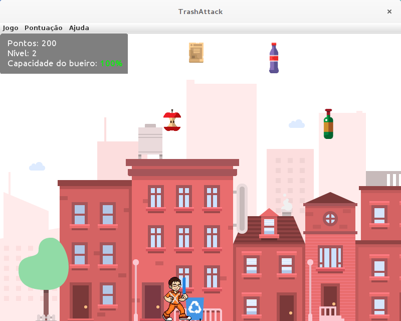

# TrashAttack-jogo
Jogo com interface gráfica baseado no clássico Space Invaders. Ao invés de naves espaciais, temos lixos sendo atirados no chão enquanto o jogador(gari) tenta capturá-los utilizando lixeiras de coleta seletiva, onde cada lixo tem sua lixeira correspondente. O objetivo é impedir que os lixos entupam o bueiro e provoquem enchentes quando chover.

Este projeto foi desenvolvido durante a graduação em Ciência da Computação na UNIP.

O arquivo [APS - Jogo.pdf](https://github.com/yuryrodrigues/TrashAttack-jogo/blob/master/APS%20-%20Jogo.pdf) contém a dissertação sobre o projeto do jogo, incluindo a descrição de sua estrutura e as ferramentas utilizadas.

Imagens do jogo
-------------------

